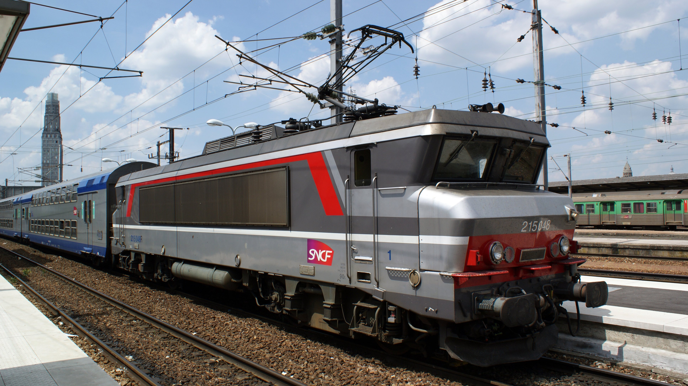
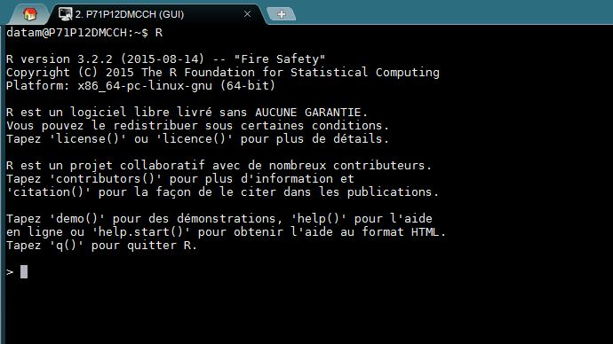
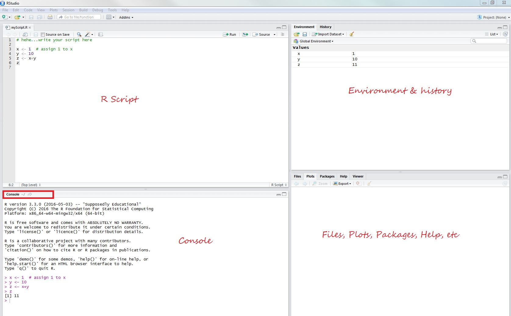

<br/>



<br/>


```{r setup, include=FALSE}
knitr::opts_chunk$set(echo = TRUE)
```

<br/>
<hr/>
<br/>

# Introduction to R


## Overview
R is a powerful **open-source statistical programming language** software program for advanced data techniques. It allows you to work on:

* statistical analysis 
* machine learning & deep learning 
* data visualization. 


## Commenting and R Environments

### Adding Comments to R Code
Comments are meant to help describe the code, and should be used when the purpose of a line of code is unclear.In `R`, lines beginning with a pound character (`#`) are each a **comment**.  Comments should be clear, concise, and helpful.

Here's an example of some commented R code, which will be explained below.

```r
# Describe purpose of computation
amount.per.day <- 10 # amount in euros
result <- 10 * 7  # budget for the week
```

### Interactive R Sessions
An interactive R session can be opened within terminal.  To open, type the letter `R` into your terminal and hit `enter`, an interactive R session will appear :



Limitation: this environment doesn't provide much of an interface for writing R scripts. 

### RStudio
RStudio is an open-source **integraded development environment**(IDE) that provides an informative user-interface for interacting with the R software program (You can  [download](https://www.rstudio.com/products/rstudio/download3/) the free version). 





The RStudio Interface:

- **Script**: Text editor for writing your R code. 
- **Console**: A console for entering R commands. This is very similar to your command-line. You can **use the up arrow** to easily access previously executed lines of code.
- **Environment**: displays information that you have stored inside of variables. 
- **Files, Plots, Packages, Help etc.**: there are multiple tabs for accessing various information. 

*Remark*: See **[rstudio-IDE-cheatsheet](https://www.rstudio.com/wp-content/uploads/2016/02/IDE-french.pdf)** for detailed information on the IDE.

### Creating Variables

In R, variable names can contain any combination of alphanumeric characters, as well as periods (`.`) or underscores (`_`) but *cannot* begin with a number, period, or underscore -- they are also case sensitive.

When you are declaring a variable in R, you use the assignment operator `<-` to store information in a variable. For example:

```r
# Stores the number 80 into a variable called monthly.transport.fee
monthly.transport.fee <- 80
```
Type the variable name into the R console and hit enter to see the information stored in a variable:

```r
  monthly.transport.fee
  ## [1] 80
```

You an also use print function
```r
print(monthly.transport.fee)
    ## [1] 80
```

It's also quite easy to use **basic mathematical operators** (`+`, `-`, `/`, `*`) in your creation of variables. For example, you could create a variable that is the sum of two numbers as follows:

```r
x <- 10 + 8
```

Other arithmetic operators include: 

- Exponentiation: `^`  : for example `3^2` equals 9.
- Modulo: `%%` : for example 5 modulo 3 or `5 %% 3` equals 2.

### Workspace

- Use [`ls()`](http://www.rdocumentation.org/packages/base/functions/ls) to show contents in the workspace. 
- Use [`rm()`](http://www.rdocumentation.org/packages/base/functions/rm) to remove contents in workspace.

```{r}
# Clear the entire workspace
rm(list = ls())

# Create the variables milk, sugar and bread
milk <- 3
sugar <- 7
bread <- 1

# Inspect the contents of the workspace again
ls()
```


### Basic Data Types

Basic data types in R:

- **Numeric**: Numeric data consists of the set of real numbers.

```r
  x <- 10.23 + 8
```

- **Character**: Character data stores strings of characters in a variable. Encapsulate the strings in either single (`'`) or double quotes (`"`): 

```r
  # Create character variable `name.manager` with the value "Guillaume THERY"
  name.manager <- "Guillaume THERY"

```
- **Boolean**: Boolean (logical) data types can only take on two values: `TRUE` and `FALSE`. 

```r
# Test if 3.15 is greater than pi, and store the results in a variable `x`
x <- 3.15 > pi # returns the boolean value TRUE since `pi=3.141593`
x
##[1] TRUE
```
- **Complex**: Complex numbers are created using the `i` syntax: 

```r
complex.variable <- 4+5i # create a complex number with real=4 & imaginary=5
```

- **Integer**: Create an integer by placing a capital `L` after an integer value in variable assignment 

```r
x.integer <- 4L
```


### Package Management and Installation

Packages are used to extend the functionality of R 

  * Installing packages from CRAN:
    + One-by-one 
```
install.packages("ggplot2")
```
    + Group 
```
list.of.packages <- c("ggplot2","reshape2","plyr","data.table","dplyr","lubridate")
new.packages <- list.of.packages[!(list.of.packages %in% installed.packages()[,"Package"])]
if(length(new.packages)) install.packages(new.packages)
```

  * Installing from Github: 
```
require(devtools)
install_github('ramnathv/rCharts')
```
  
  * To load a package (need to load before using)
```
library("ggplot2")
```

* `all.packages <- available.packages()` to get the list of all the packages in CRAN


<br/>
<hr/>
<br/>


# Data Imports, Preparation & Manipulation 

## Getting Started and Resource

```r
?mean  # help on a function
help.search('kurtosis') # search help files for a word
help(package = 'ggplot2') # find help in package
search() # to list all of the functions now available to you
getwd() # to get the working directory
setwd() # to change the working directory
```

In getting started with R, RCheatSheet's will be provided as supporting documents to avoid repetitions in this training session. Participants can download such reference cards via RStudio [website](https://www.rstudio.com/resources/cheatsheets/). 

*Remark*: We will use the **[Base R CheatSheet](https://www.rstudio.com/wp-content/uploads/2016/10/r-cheat-sheet-3.pdf)** to learn basic `R` syntax: Vectors, Matrices, Lists, Data Frames, Functions and etc. 


## How To Create A Simple Data Frame in R

```{r}
Died.At <- c(22,40,72,41)
Writer.At <- c(16, 18, 36, 36)
First.Name <- I(c("Kevin", "Helen", "Walt", "Janet"))
Second.Name <- I(c("Doe", "Danse", "Whitman", "Austen"))
Sex <- c("MALE", "FEMALE", "MALE", "FEMALE")
Date.Of.Death <- as.Date(c("2015-05-10", "1949-10-07", "1992-03-26","1887-07-18"))
writers_df <- data.frame(Died.At, Writer.At, First.Name, Second.Name, Sex, Date.Of.Death)
head(writers_df) # to get the head in the data frame
tail(writers_df) # to get the tail in the data frame
```

Convert column `Date.Of.Death` as date format: 
```{r}
suppressMessages(library(lubridate))
writers_df$Date.Of.Death <- ymd(writers_df$Date.Of.Death)
str(writers_df)
```

### What you need to know about Data Frames

We make use of the [Airline Dataset](http://stat-computing.org/dataexpo/2009/the-data.html).
The data comes originally from [RITA](http://www.transtats.bts.gov/OT_Delay/OT_DelayCause1.asp) where it is described in detail.

```{r}
data <- read.csv("allyears2k.csv") # to read a CSV file into a data frame
names(data) # get names of variables / fields in the data frame
dim(data) # dimension of data frame
nrow(data) # to get the number of rows in the data frame
ncol(data) # to get the number of columns in the data frame
head(data,2) # to get the head of 2 rows in the data frame
tail(data,2) # to get the tail of 2 rows in the data frame
```


```r
str(data) # to get structure of the data frame
attributes(data) #  to see the data frame attributes
summary(data) # to see data summary
data$Year # to see the column Year...same as data[[1]]
data[1] # to create a new data frame with just column 1
data[1:4] # to create a data frame with first four columns
data[, 1] # to get column 1 listed
data$Year[20] # to get the 20th element in the Year column
tail(data,2) # to get the tail of 2 rows in the data frame
write.csv(data,"mydataname.csv", row.names = FALSE) # save a dataset in csv
```

* thus `data[,1][47]` is then the same as `data$Year[47]`
* `length(data$IsArrDelayed[is.na(data$IsArrDelayed)])` to find the number of NAs in a given column (IsArrDelayed) in a data frame

```{r}
# to get the mean of the valid numbers in the group
mean(data$Cancelled[!is.na(data$Cancelled)]) 
# to get the mean value of Departure Delay where Arrival Delay is > 10 and Day Of Week is Monday
mean(subset(data, !is.na(data$CarrierDelay) & data$ArrDelay > 10 & data$DayOfWeek == 1)$DepDelay) 
```


<br/>
<hr/>
<br/>


# Faster Data Manipulation in R using dplyr

## Introduction

* Five basic verbs: `filter`, `select`, `arrange`, `mutate`, `summarise` (plus `group_by`)
* dplyr will mask a few base functions
* The data on Régularité mensuelle TGV depuis septembre 2011. The data can be download from the SNCF Open data platform. Click on [download](https://ressources.data.sncf.com/explore/dataset/regularite-mensuelle-tgv/information/?sort=nombre_de_trains_annules) for data.


```{r}
# load packages
suppressMessages(library(dplyr))
suppressMessages(library(lubridate))

# import data from current working directory (eg data in the folder "opendatasncf")

regularite.mensuelle.tgv <- read.csv("opendatasncf/regularite-mensuelle-tgv.csv", 
                                     encoding="UTF-8", sep=";")

# view data

head(regularite.mensuelle.tgv)
```

* `tbl_df` creates a "local data frame"
* Local data frame is simply a wrapper for a data frame that prints nicely

```{r}
# convert to local data frame

regularite <- tbl_df(regularite.mensuelle.tgv)

# rename columns by removing french accents
colnames(regularite)<-c("Date","Axe","Depart","Arrivee","Nombre.de.trains.programmes",
                        "Nombre.de.trains.ayant.circule","Nombre.de.trains.annules",
                        "Nombre.de.trains.en.retard.a.l.arrivee","Regularite","Commentaires") 

# printing only shows 10 rows and as many columns as can fit on your screen
regularite
```

```{r results='hide'}
# you can change Date in date format
regularite$Date1 <- paste0(regularite$Date,sep='-',01) # add a day part of date
regularite$Date2 <- ymd(regularite$Date1) # date column
regularite$Year <- year(regularite$Date2)
regularite$Month <- month(regularite$Date2)
regularite$Quarters <- quarters(regularite$Date2)

# you can specify that you want to see more rows
print(regularite, n=20)

# convert to a normal data frame to see all of the columns
data.frame(head(regularite))
```


## filter: Keep rows matching criteria

* Base R approach to filtering forces you to repeat the data frame's name
* dplyr approach is simpler to write and read
* Command structure (for all dplyr verbs):
    * first argument is a data frame
    * return value is a data frame
    * nothing is modified in place


```{r results='hide'}
# base R approach to view all regularite on Quarter 1 and January 
regularite[regularite$Quarters=='Q1' & regularite$Month==1, ]
#another method
subset(regularite,regularite$Quarters=='Q1' & regularite$Month==1)
subset(regularite,Quarters=='Q1' & Month==1)
```

```{r}
# dplyr approach
# note: you can use comma or ampersand to represent AND condition
filter(regularite, Quarters=='Q1', Month==1)

# use pipe for OR condition
filter(regularite, Depart=="LYON PART DIEU" | Depart=="PARIS NORD")
```

```{r results='hide'}
# you can also use %in% operator
filter(regularite, Depart %in% c("LYON PART DIEU", "PARIS NORD"))
```


## select: Pick columns by name

* Base R approach is awkward to type and to read
* dplyr approach uses similar syntax to `filter`
* Like a SELECT in SQL

```{r results='hide'}
# base R approach to select Depart, Arrivee, and Nombre.de.trains.programmes columns
regularite[, c("Depart", "Arrivee", "Nombre.de.trains.programmes")]
```

```{r}
# dplyr approach
select(regularite, Depart, Arrivee, Nombre.de.trains.programmes)

# use colon to select multiple contiguous columns, and use `contains` to match columns by name
# note: `starts_with`, `ends_with`, and `matches` (for regular expressions) 
# can also be used to match columns by name
select(regularite, Year:Month, contains("annules"), contains("retard"))
```


## Chaining Method (`%>%`: "then" operator)

* Usual way to perform multiple operations in one line is by nesting
* Chaining increases readability significantly when there are many commands

```{r results='hide'}
# nesting method to select Depart and Nombre.de.trains.en.retard.a.l.arrivee columns 
# and filter for delays over 60 minutes
filter(select(regularite, Depart, Nombre.de.trains.en.retard.a.l.arrivee), 
       Nombre.de.trains.en.retard.a.l.arrivee > 60)
```

```{r}
# chaining method
regularite %>%
    select(Depart, Nombre.de.trains.en.retard.a.l.arrivee) %>%
    filter(Nombre.de.trains.en.retard.a.l.arrivee > 60)
```


* Operator is automatically imported from the [magrittr](https://github.com/smbache/magrittr) package
* Can be used to replace nesting in R commands outside of dplyr

```{r results='hide'}
# create two vectors and calculate Euclidian distance between them
a <- 3:7; b <- 1:5
sqrt(sum((a-b)^2))
```

```{r}
# chaining method
(a-b)^2 %>% sum() %>% sqrt()
```


## arrange: Reorder rows

```{r results='hide'}
# base R approach to select Depart and Nombre.de.trains.en.retard.a.l.arrivee columns and sort by 
# Nombre.de.trains.en.retard.a.l.arrivee
regularite[order(regularite$Nombre.de.trains.en.retard.a.l.arrivee), 
           c("Depart", "Nombre.de.trains.en.retard.a.l.arrivee")]
```

```{r}
# dplyr approach
regularite %>%
    select(Depart, Nombre.de.trains.en.retard.a.l.arrivee) %>%
    arrange(Nombre.de.trains.en.retard.a.l.arrivee)
```

```{r results='hide'}
# use `desc` for descending
regularite %>%
    select(Depart, Nombre.de.trains.en.retard.a.l.arrivee) %>%
    arrange(desc(Nombre.de.trains.en.retard.a.l.arrivee))
```


## mutate: Add new variables

* Create new variables that are functions of existing variables

```{r results='hide'}
# base R approach to create a new variable Non.Regularite (in %)
regularite$Non.Regularite <- 100-regularite$Regularite 
regularite[, c("Regularite", "Arrivee", "Non.Regularite")]
```

```{r}
# dplyr approach (prints the new variable but does not store it)
regularite %>%
    select(Regularite, Arrivee) %>%
    mutate(Non.Regularite = 100-Regularite)

# store the new variable
regularite <- regularite %>% mutate(Non.Regularite = 100-Regularite)
```


## summarise: Reduce variables to values

* Useful with data that has been grouped by one or more variables
* `group_by` creates the groups that will be operated on
* `summarise` uses the provided aggregation function to summarise each group

```{r results='hide'}
# base R approaches to calculate the average arrival delay to each destination
head(with(regularite, tapply(Nombre.de.trains.en.retard.a.l.arrivee, Arrivee, mean, na.rm=TRUE)))
head(aggregate(Nombre.de.trains.en.retard.a.l.arrivee ~ Arrivee, regularite, mean))
```

```{r}
# dplyr approach: create a table grouped by Arrivee, and then summarise each group 
# by taking the mean of Nombre.de.trains.en.retard.a.l.arrivee
regularite %>%
    group_by(Arrivee) %>%
    summarise(avg_delay = mean(Nombre.de.trains.en.retard.a.l.arrivee, na.rm=TRUE))
```

* `summarise_each` allows you to apply the same summary function to multiple columns at once
* Note: `mutate_each` is also available

```{r}
# for each Depart, calculate the mean of Nombre.de.trains.annules or 
# Nombre.de.trains.en.retard.a.l.arrivee
regularite %>%
    group_by(Depart) %>%
    summarise_each(funs(mean), Nombre.de.trains.annules, 
                   Nombre.de.trains.en.retard.a.l.arrivee)

# for each Depart, calculate the minimum and maximum arrival delays
regularite %>%
    group_by(Depart) %>%
    summarise_each(funs(min(., na.rm=TRUE), max(., na.rm=TRUE)), 
                   matches("Nombre.de.trains.en.retard.a.l.arrivee"))
```

* Helper function `n()` counts the number of rows in a group
* Helper function `n_distinct(vector)` counts the number of unique items in that vector

```{r}
# for each month of the year, count the total number of rows and sort in descending order
regularite %>%
    group_by(Year, Month) %>%
    summarise(row_count = n()) %>%
    arrange(desc(row_count))

# rewrite more simply with the `tally` function
regularite %>%
    group_by(Year, Month) %>%
    tally(sort = TRUE)

# for each Axe, count the total number of distinct destination
regularite %>%
    group_by(Axe) %>%
    summarise(Arrivee_count = n_distinct(Arrivee))
```


## Window Functions

* Aggregation function (like `mean`) takes n inputs and returns 1 value
* [Window function](http://cran.r-project.org/web/packages/dplyr/vignettes/window-functions.html) takes n inputs and returns n values
    * Includes ranking and ordering functions (like `min_rank`), offset functions (`lead` and `lag`), and cumulative aggregates (like `cummean`).

```{r results='hide'}
# for each Departure, calculate which three months of the year they had their 
# longest departure delays
# note: smallest (not largest) value is ranked as 1, so you have to 
# use `desc` to rank by largest value
regularite %>%
    group_by(Depart) %>%
    select(Quarters, Month, Nombre.de.trains.en.retard.a.l.arrivee) %>%
    filter(min_rank(desc(Nombre.de.trains.en.retard.a.l.arrivee)) <= 3) %>%
    arrange(Depart, desc(Nombre.de.trains.en.retard.a.l.arrivee))
```

```{r}
# rewrite more simply with the `top_n` function
regularite %>%
    group_by(Depart) %>%
    select(Quarters, Month, Nombre.de.trains.en.retard.a.l.arrivee) %>%
    top_n(3) %>%
    arrange(Depart, desc(Nombre.de.trains.en.retard.a.l.arrivee))

# for each Quarter, calculate the number of observations and the change from the previous Quarter
regularite %>%
    group_by(Quarters) %>%
    summarise(row_count = n()) %>%
    mutate(change = row_count - lag(row_count))

# rewrite more simply with the `tally` function
regularite %>%
    group_by(Quarters) %>%
    tally() %>%
    mutate(change = n - lag(n))
```


## Some Useful Functions

```{r}
# randomly sample a fixed number of rows, without replacement
regularite %>% sample_n(5)

# randomly sample a fraction of rows, with replacement
regularite %>% sample_frac(0.25, replace=TRUE)

# base R approach to view the structure of an object
str(regularite)

# dplyr approach: better formatting, and adapts to your screen width
glimpse(regularite)
```


<br/>
<hr/>
<br/>


# Descriptive Statistics, EDA & Statistical testing

## Descriptive Statistics
Let us play with the Airline Dataset previously loaded in `R` 

```{r}
names(data) # Airline dataset 
```

### Contingency table

```{r}
# Create new column by grouping Departure Delay
data$groupDepDelay<- with(data,cut(DepDelay, quantile(DepDelay,na.rm=T)))
# Create contingency table
my.table0<-with(data, table(groupDepDelay,DayOfWeek))
prop.table(my.table0,1)


```


```{r}
# Alternative Approach ... direct 
# to build a contingency table of the counts at each combination of factor levels
with(data,table(DayOfWeek,IsArrDelayed)) # same as table(data$DayOfWeek,data$IsArrDelayed) 
# to get probabilities of Depture Delay on each Day of Week
my.table<-with(data, table(cut(DepDelay, quantile(DepDelay,na.rm=T)),DayOfWeek))
prop.table(my.table,1)

```


### Balloon Plot

```{r}
suppressMessages(library(gplots))
suppressMessages(library(tidyr))
suppressMessages(library(dplyr))
## Checks on departure delays 
data.filter4 <- data %>% filter(IsDepDelayed == 'YES')
data.select <- data.filter4 %>% select(DayOfWeek,UniqueCarrier)
tab<- (table(data.select))
tab
# Plot a graphical matrix
balloonplot(t(tab), main ="Funny Balloon Plot", ylab ="DayOfWeek", xlab="UniqueCarrier",
         label = FALSE, show.margins = FALSE)
```


### Boxplots

Checks on Departures Delayed from Boston between Year 2000 and 2006

```{r, message=F, warning=F, fig.width=10}
# Librairy
library(ggplot2)
library(tidyr)
library(dplyr)
library(shiny)
library(ggvis)
library(corrplot)
library(data.table)
library(lubridate)

require(Matrix)
if (!require('vcd')) install.packages('vcd')
library(Ckmeans.1d.dp)


## Checks on Departures Delayed from Boston between Year 2000 and 2006

data.filter1 <- data %>% filter(IsDepDelayed == 'YES', Year >= 2000 & Year<2007,
                                Origin =='BOS')

par(las=2,                        # use perpendicular axis labels
    mar=c(10.1,4.1,4.1,2.1),      # create enough space for long x labels
    mgp=c(8,1,0)                  # move x axis legend down to avoid overlap
)

# start with simple boxplot with options 
boxplot(DepDelay~UniqueCarrier,data=data.filter1)

#par(mfrow=c(1,3))
boxplot(DepDelay~UniqueCarrier,data=data.filter1, main="UniqueCarrier", xlab="Departures Delay",
        ylab="Lifetime",col="#357EC7")
boxplot(DepDelay~DayOfWeek,data=data.filter1, main="Day Of Week", xlab="Departures Delay", 
        ylab="",col="#357EC7") # Day Of Week = 1 is Monday
boxplot(DepDelay~UniqueCarrier+DayOfWeek,data=data.filter1, 
        main="UniqueCarrier & DayOfWeek", xlab="Departures Delay", ylab="Lifetime",col="#357EC7") 
```


### Histogram

```{r}

## Histogram of Distance on full data set
with(data,hist(Distance))

```


```{r}
## Checks on early arrivals from Boston 
data.filter2 <- data %>% filter(IsDepDelayed == 'NO', ArrDelay == 0,Origin=='BOS')
summary(data.filter2)

## Histogram of Distance on filter dataset 
with(data.filter2,hist(Distance))
```


### Visualization of a correlation matrix

```{r}
## Filter and List only numeric columns from a data frame
nums <- sapply(data, is.numeric) 
data.filter3 <- data[,nums]

# Replace NAs in data with 0
data.filter3[is.na(data.filter3)] <- 0
cor.matrix <-cor(data.filter3,use = "na.or.complete")
corrplot(cor.matrix)


# ?corrplot # for more details 

corrplot(cor.matrix, order="hclust", hclust.method="complete", addrect = 4)


# names(cor.matrix) <- colnames(data.filter3) 
cor.clust <- hclust(dist(cor.matrix), method = "complete")
plot(cor.clust)
rect.hclust(cor.clust, k = 4)

```

## Time Series Analysis

```{r, message=F, warning=F, fig.width=10}
library(quantmod)
library(fBasics)
library(tseries)
library(Hmisc)

getSymbols("^FCHI",src="yahoo")
chartSeries(FCHI) # CAC 40 
write.zoo(FCHI,"FCHI.csv",index.name="Date",sep=",") # save an xts object to csv

FCHI.import<- read.csv('FCHI.csv')
FCHI <- as.timeSeries(FCHI.import)
plot(FCHI, main="CAC 40")
```

### Checking Basic Statistics 

```{r, message=F, warning=F}
basicStats(FCHI) # Basic Statistics
```

### Visualise the Closing Price of CAC 40 

```{r, message=F, warning=F, fig.width=10}
cac40.close <- as.timeSeries(FCHI[,4]) #cac40.close <- as.ts(FCHI[,4],start=c(2007,01,02))
plot(cac40.close, type = "l", col = "steelblue", main = "CAC 40")
abline(h = 0, col = "grey")
```

### Histogram & Density Plots: 

```{r, message=F, warning=F, fig.width=10}
histPlot(cac40.close) 
densityPlot(cac40.close)

```

### Descriptive Statistics on the Closing Price of CAC 40 

```{r, message=F, warning=F, fig.width=10}
summary(cac40.close)
describe(cac40.close)

```

## Hypothesis Testing 

### Tests the null of normality: 

```{r, message=F, warning=F}
jarque.bera.test(cac40.close) # Tests the null of normality

```

### Test for Trend Stationarity

```{r, message=F, warning=F, fig.width=10}
kpss.test(cac40.close, null = "Trend") # KPSS Test for Trend Stationarity 
```

### Augmented Dickey-Fuller Test for Stationarity:  

```{r, message=F, warning=F, fig.width=10}
tseries::adf.test(cac40.close, k = 10)  # Augmented Dickey-Fuller Test 
```

```{r, message=F, warning=F, fig.width=10}
adf.test(diff(log(cac40.close))[-1,], alternative="stationary", k=0)  # Augmented Dickey-Fuller Test
```

## Time Series of difference of log CAC 40
```{r, message=F, warning=F}
cac40.close.df <- diff(log(cac40.close))[-1,]
plot(cac40.close.df, type = "l", col = "steelblue", main = "CAC 40")
abline(h = 0, col = "grey")
```


## Autocorrelation Function Plots 

```{r, message=F, warning=F, fig.width=10}
acfPlot(cac40.close.df)
pacfPlot(cac40.close.df)
```

## Modeling 

```{r}
fit <- arima(cac40.close.df, order = c(5, 0, 0))
fit
summary(fit)
tsdiag(fit)
```


<br/>
<hr/>
<br/>


# Introduction to Data Science Algorithms in R 

## Ensemble Feature Selection on Titanic Dataset


```{r, message=FALSE, warning=FALSE}
# install.packages("fscaret", dependencies = c("Depends", "Suggests"))

library(fscaret)
library(caret)
```

```
# list of models on fscaret packages:
data(funcRegPred)
model.list <-data.frame(models=funcRegPred)

# list of models on caret packages:
names(getModelInfo())
```

```{r, message=FALSE, warning=FALSE}
# Import dataset from the UCI Machine Learning Repository 
# (http://archive.ics.uci.edu/ml/datasets.html)
# titanic.data <- read.csv('http://math.ucdenver.edu/RTutorial/titanic.txt',sep='\t') 
titanic.data <- read.csv('titanic.txt',sep='\t') # import data from working directory
```

```{r, message=FALSE, warning=FALSE}
# creating new title feature
titanic.data$Title <- ifelse(grepl('Mr ',titanic.data$Name),'Mr',
                             ifelse(grepl('Mrs ',titanic.data$Name),'Mrs',
                                    ifelse(grepl('Miss',titanic.data$Name),'Miss','Nothing')))
titanic.data$Title <- as.factor(titanic.data$Title)

# Replace NAs in Age with the median age 
titanic.data$Age[is.na(titanic.data$Age)] <- median(titanic.data$Age, na.rm=T)
```

```{r, message=FALSE, warning=FALSE}
# reorder data set so response variable is last column
titanic.data <- titanic.data[c('PClass', 'Age',    'Sex',   'Title', 'Survived')]

# binarize all factors
titanicDummy <- dummyVars("~.",data=titanic.data, fullRank=F)
titanic.data <- as.data.frame(predict(titanicDummy,titanic.data))

```
We have a look at the structure of data
```{r, message=FALSE, warning=FALSE}
str(titanic.data)
```

```{r, message=FALSE, warning=FALSE}
# split data set into train and test portion
set.seed(1234)
splitIndex <- createDataPartition(titanic.data$Survived, p = .75, list = FALSE, times = 1)
# splitIndex <- sample(nrow(titanic.data), floor(0.75*nrow(titanic.data)))
trainDF <- titanic.data[ splitIndex,]
testDF  <- titanic.data[-splitIndex,]
```

We now run an ensemble feature selection specifying list of models available on 'fscaret' package:

```{r results='hide', message=FALSE, warning=FALSE}
# limit models to use in ensemble and run fscaret
featureSelection.models <- c("glm", "gbm", "treebag", "ridge", "lasso")
featureSelection<-fscaret(trainDF, testDF, myTimeLimit = 40, preprocessData=TRUE,
              Used.funcRegPred = featureSelection.models, with.labels=TRUE,
              supress.output=FALSE, no.cores=2)
```

```{r, message=FALSE, warning=FALSE}
# analyze results
print(featureSelection$VarImp)
print(featureSelection$PPlabels)
```


<br/>
<hr/>
<br/>


# References (Some useful R links)

I do recommend that you simply use seach engines to find out the links to resources that suits you. Here are a few of such links: 

Introduction:

- Introduction to R [https://cran.r-project.org/doc/manuals/R-intro.html](https://cran.r-project.org/doc/manuals/R-intro.html)
- Interactive intro to R programming language  [https://www.datacamp.com/courses/introduction-to-r](https://www.datacamp.com/courses/introduction-to-r)
- for data manipulation [https://cran.rstudio.com/web/packages/dplyr/vignettes/introduction.html](https://cran.rstudio.com/web/packages/dplyr/vignettes/introduction.html)
  
Graphics:

- Tutorial on plots http://cran.r-project.org/doc/contrib/Rossiter-RIntro-ITC.pdf

Statistics: 

- Quick-R [http://www.statmethods.net/](http://www.statmethods.net/)
- Beginner’s tutorial for Time Series  [http://www.stat.pitt.edu/stoffer/tsa2/index.html](http://www.stat.pitt.edu/stoffer/tsa2/index.html)

<br/>

<center> **Last updated on February 2017, SNCF Division MMI** </center>
